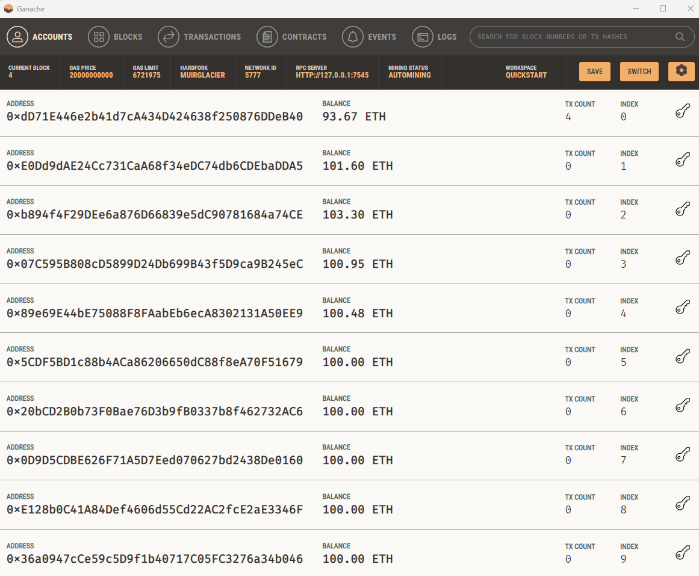

# Cryptographic Currency Wallets

Integrating the Ethereum blockchain network, this application empowers customers to instantly pay fintech professionals with cryptocurrency. By integrating Ethereum into the payment process, we enhance payment speed, reduce costs, expand global reach, and bolster transaction security and transparency.

## Overview

This application allows customers to search for and hire fintech professionals, streamlining the payment process through Ethereum blockchain integration. Users can easily pay for services with cryptocurrency, enjoying the benefits of a decentralized financial system.

### Digital Wallet Integration

- **Ethereum Account Management:** Accessing Ethereum account balances via a digital wallet.
- **Transaction Signing and Sending:** Utilizing a personal Ethereum blockchain, Ganache, for transactions.

  

## KryptoJobs2Go

KryptoJobs2Go is a unique platform for hiring fintech experts:

- **User-Friendly Interface:** Selecting candidates, setting work hours, and initiating payments.

  

### Transactions

- **Process:** Choose a candidate, input hours, and click to sign and send Ethereum transactions.
- **Transaction History:** Monitoring final balances and transaction history.

  

### Detailed Transaction Views

#### Hiring Ash for 10 Hours

- **Transaction Completion for Ash:** Confirming and viewing details.

  
  
  

## Conclusion

The integration of Ethereum blockchain in this fintech application revolutionizes how customers interact with and pay for professional services. It stands as a testament to the potential of blockchain technology in reshaping financial transactions.

## Support

For support, please open an issue in the [GitHub Issue Tracker](https://github.com/YourRepository/CryptographicCurrencyWallets/issues). You can also find help and discussion on our community forums at [Community Forum Link].

## Roadmap

See the [open issues](https://github.com/YourRepository/CryptographicCurrencyWallets/issues) for a list of proposed features (and known issues). Future plans include:
- Feature 1
- Feature 2
- Improvements in security

## Contributing

Contributions are what make the open-source community such an amazing place to learn, inspire, and create. Any contributions you make are **greatly appreciated**.

If you have a suggestion that would make this better, please fork the repo and create a pull request. You can also simply open an issue with the tag "enhancement".

Don't forget to give the project a star! Thanks again!

1. Fork the Project
2. Create your Feature Branch (`git checkout -b feature/AmazingFeature`)
3. Commit your Changes (`git commit -m 'Add some AmazingFeature'`)
4. Push to the Branch (`git push origin feature/AmazingFeature`)
5. Open a Pull Request

## Legal Disclaimer

### This project is for educational purposes only and is not financial or investment advice. The creators are not responsible for actions taken based on this information.

## Badges

